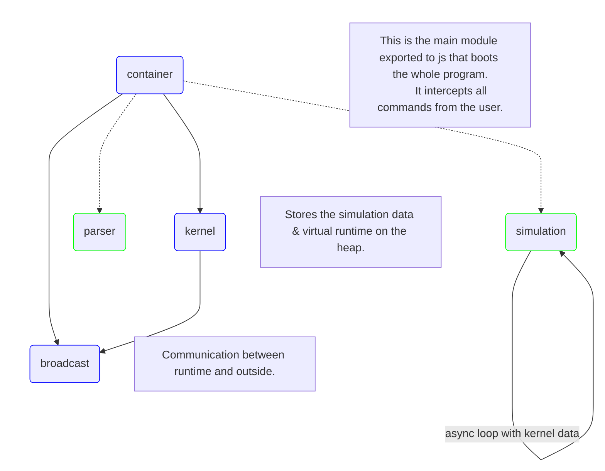

# Vif-sim

This is the rust program that parses & runs a virtual simulation using the typescript front-end data.

// Notes:

Still WIP and very experimental.

Due to the recent release of WIT component, a lot of js glue code present in this package is now obsolete.

This project was built to solve problems first and be refactored later, some parts are not "idiomatic" rust and a lot of things can be simplified.

If you have any questions about certain parts (for example on how all possible operations on plc primitives are declared at compile time despite orphan rule), feel free to ask me.

The generative macro used by the parser to quickly get JSON values can be found as a gist [here](https://gist.github.com/adclz/be7a383580975672e413430c679d3a00): 

## Architecture

## Debug

Run & Debug should work fine on `x86_64-pc-windows-msvc` target.

Untested on Linux & Mac but since this project was primarily built for the `wasm32-unknown-unknown` target most of the code is no-std.

## Build

Use `Powershell -File build.ps1` to compile wasm packages.

Output: 
 - `pkg_web`: browser
 - `pkg_node`: node

Wasm-opt might slow down compilation time when optimizing wasm binaries, you can disable it by adding a `--dev` flag next to `wasm-pack build` in build.ps1